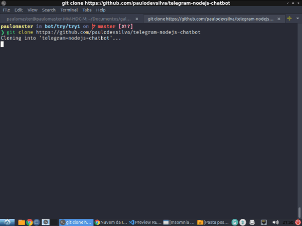
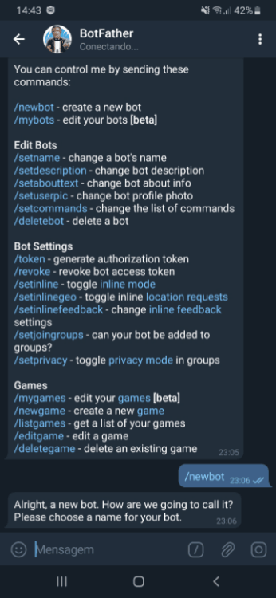
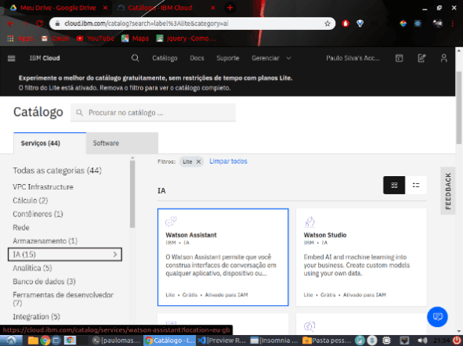
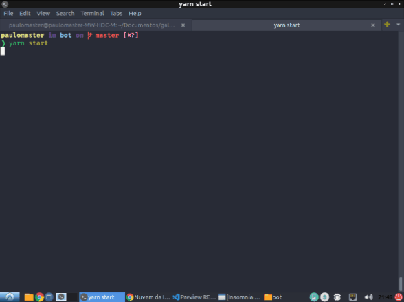

# Telegram Nodejs ChatBot 


[](https://github.com/paulodevsilva)
[](https://github.com/paulodevsilva/telegram-nodejs-chatbot/stargazers)


> Chatbot for telegram integrated with IBM Watson.


# :pushpin: Table of Contents

* [Installation](#construction_worker-installation)
* [Getting Started](#runner-start-project)


# :construction_worker: Installation

**You need to install [Node.js](https://nodejs.org/en/download/) and [Yarn](https://yarnpkg.com/) first, then clone the repository.**

**Cloning Repository**

```
git clone https://github.com/paulodevsilva/telegram-nodejs-chatbot.git

```




**Install dependencies**
``` 
npm install or yarn install
```


**Create Telegram Bot**

You need to create your telegram bot, for this you need to start a chat with the BotFather and copy the token, as below:




**Api: Watson**

You must also create the credentials of *Watson* on the site of [IBM](https://cloud.ibm.com/login), also has no secret, just register, when you are logged in the top menu click on **Catalogue**, then within **IA** search for *Watson Assistant*.



by clicking on it, a "create" button will appear at the bottom of the page, once the service is created, you will be redirected to the management page of the service you just created, in the left side menu look for **Service Credentials** and then click on **Auto-generated service credentials** highlighted below, then copy the *Credentials* being them **url** and **apiKey**.


-  **Create Skill and Assistant**

      Create an assistant and copy the AssistantId then import the project's standard skill or create your own. 
     
      Note: skill is what defines how your bot will behave and how it responds and identifies what the user says.
 
**Insert environment variables**

``` js
  TELEGRAM_TOKEN=
  ASSISTANT_ID=
  ASSISTANT_API_KEY=
  ASSISTANT_VERSION=
  ASSISTANT_URL=

```

# :runner: Start Project

Run the following command in order to start the application in a development environment:

```
yarn dev or npm run dev
```




